### nnyj

Software engineer/DevOps from Malaysia. I build tools that fix small annoying things.

**Audio**
- [Deej-AI](https://github.com/nnyj/Deej-AI) — "keep playing songs like this" for foobar2000, similar-sounding playlists from your local library via ONNX
- [pyVBAN](https://github.com/nnyj/pyVBAN) — VBAN network audio in Python, send/receive PCM or Opus with device picker CLI
- [python-audio-separator-live](https://github.com/nnyj/python-audio-separator-live) — real-time vocal/instrumental separation using MDX-NET and MelBand Roformer
- [virtual-surround-sound](https://github.com/nnyj/virtual-surround-sound) — headphone virtual 7.1 surround on Windows, custom APO + VB-Cable + HeSuVi with live output switching
- [jscript-panel-docs](https://github.com/nnyj/jscript-panel-docs) — JScript Panel 3 docs & binary for foobar2000

**Editor extensions**
- [obsidian-mobile-tab-bar](https://github.com/nnyj/obsidian-mobile-tab-bar) — browser-style tab bar for Obsidian mobile
- [obsidian-indented-table](https://github.com/nnyj/obsidian-indented-table) — styles indented pipe tables in Obsidian live preview
- [obsidian-fix-tab-size](https://github.com/nnyj/obsidian-fix-tab-size) — fixes Obsidian's hardcoded 4-space list indent
- [obsidian-nnyj-syntax-highlight](https://github.com/nnyj/obsidian-nnyj-syntax-highlight) — CM6 syntax decorations for markdown notes
- [vscode-line-highlight](https://github.com/nnyj/vscode-line-highlight) — file-based line highlighting for VS Code, driven by JSON or AI tools
- [vscode-settings-toggler](https://github.com/nnyj/vscode-settings-toggler) — cycle any VS Code setting with a keybind
- [vscode-nnyj-syntax-highlight](https://github.com/nnyj/vscode-nnyj-syntax-highlight) — custom TextMate grammar injections for Markdown and Terraform HCL

**Desktop**
- [wearos-remote](https://github.com/nnyj/wearos-remote) — lock/sleep/wake a PC from a Galaxy Watch, Wear OS tile + Wake-on-LAN
- [WakeScope](https://github.com/nnyj/WakeScope) — Windows wake/sleep monitor
- [shelter-plugins](https://github.com/nnyj/shelter-plugins) — Discord client plugins for Shelter

**DevOps**
- [azure-instance-selector](https://github.com/nnyj/azure-instance-selector) — filter Azure VM sizes by vCPU/memory/GPU/price with spot pricing, credential-free Azure port of amazon-ec2-instance-selector

**Scripts**
- [user-scripts](https://github.com/nnyj/user-scripts) — browser userscripts
- [bash-scripts](https://github.com/nnyj/bash-scripts) — shell profile.d scripts and utilities

